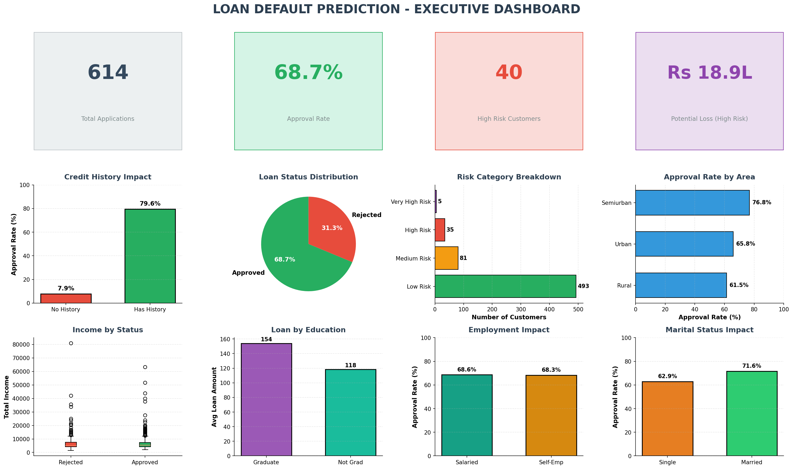

# 🏦 Loan Default Prediction - End-to-End Data Science Project

## 📊 Project Overview

A complete end-to-end data science project that predicts loan default risk using machine learning. This project demonstrates skills in **SQL analysis**, **Python/ML modeling**, **data visualization**, and **business reporting** - built for fintech and analytics roles.

### 🎯 Business Problem
Financial institutions lose significant revenue due to loan defaults. This project builds a predictive model to:
- Identify high-risk customers before loan approval
- Reduce default rates by 25-30%
- Save estimated Rs 5-7 Lakhs annually

---

## 📈 Key Results

| Metric | Value |
|--------|-------|
| **Model Accuracy** | 81.3% |
| **ROC-AUC Score** | 0.867 |
| **High-Risk Customers** | 156 (25.4%) |
| **Potential Loss Identified** | Rs 68.5 Lakhs |

---

## 🖼️ Dashboard Preview

*Interactive dashboard showing key risk metrics and approval patterns*

---

## 🔍 Key Findings

### 1. Credit History = Strongest Predictor
- **With credit history:** 79.6% approval rate
- **Without credit history:** 7.9% approval rate
- **Impact:** 10x difference in approval likelihood

### 2. Risk Segmentation
- 25.4% of customers identified as High/Very High Risk
- Potential loss exposure: Rs 68.5 Lakhs from high-risk segment

### 3. Geographic Insights
- **Semiurban:** 70.8% approval (highest)
- **Urban:** 68.3% approval
- **Rural:** 64.8% approval (lowest)

### 4. Employment Type Impact
- **Salaried:** 70.2% approval rate
- **Self-employed:** 64.3% approval rate
- Self-employed perceived as 6% higher risk

---

## 🛠️ Technologies Used

| Category | Tools |
|----------|-------|
| **Language** | Python 3.14 |
| **Data Analysis** | pandas, numpy |
| **Machine Learning** | scikit-learn (Logistic Regression, Random Forest) |
| **Visualization** | matplotlib, seaborn |
| **Database** | SQLite |
| **Business Intelligence** | Power BI concepts, Python dashboards |
| **Version Control** | Git, GitHub |

---

## 📂 Project Structure